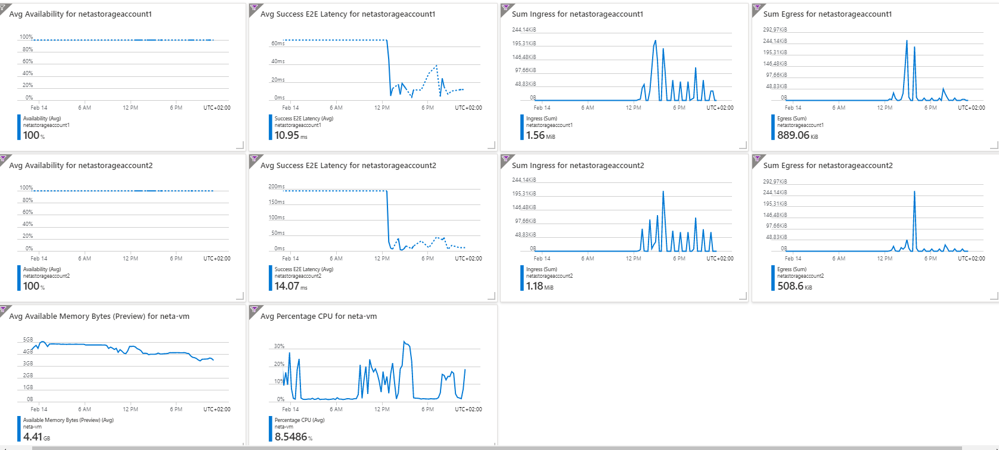

# Description
In this project I created an ARM template for storage account and for Windows server. I also Created a tool to deploy the Storage accounts and the server using azure pipeline.
I worte a script that uplods 100 blobs to one storage and copy them to the other one.

# VM
For this task I user windows VM.
Windows Server is the platform for building an infrastructure of connected applications, networks, and web services, from the workgroup to the data center. 
It bridges on-premises environments with Azure, adding additional layers of security while helping you modernize your applications and infrastructure

# Resource Group
A resource group is a container that holds related resources for an Azure solution. The resource group can include all the resources for the solution, or only those resources that you want to manage as a group

# Storage Account
An Azure storage account contains all of your Azure Storage data objects: blobs, file shares, queues, tables, and disks.

# Container
A container organizes a set of blobs, similar to a directory in a file system.

# Blob Storage
Azure Blob storage is Microsoft's object storage solution for the cloud. Blob storage is optimized for storing massive amounts of unstructured data. Unstructured data is data that doesn't adhere to a particular data model or definition, such as text or binary data.

# Dashboard

Link to My full [metric dashboard](https://ms.portal.azure.com/#@microsoft.onmicrosoft.com/dashboard/arm/subscriptions/a8108c2b-496c-424d-8347-ecc8afb6384c/resourcegroups/dashboards/providers/microsoft.portal/dashboards/972942fd-e5bc-4a4b-a3f5-64bdf37d2306)
